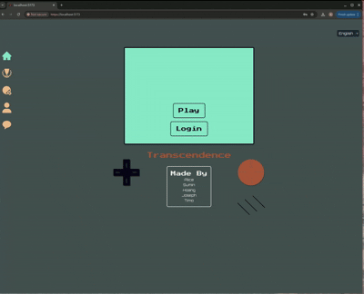
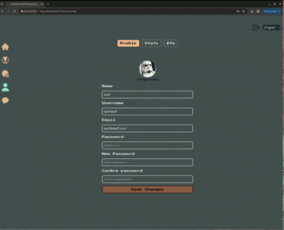
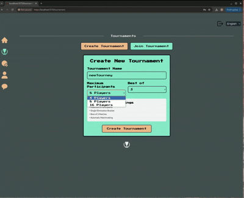
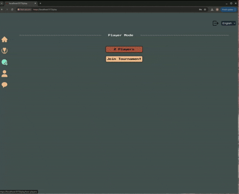
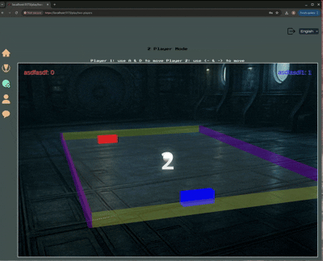

MIT License

Copyright (c) [2025] [Hoang Tran], [Alice Li Maunumäki], [Timo Saari], [Joseph Lu], [Stella-Kwon]

Permission is hereby granted, free of charge, to any person obtaining a copy
of this software and associated documentation files (the "Software"), to deal
in the Software without restriction, including without limitation the rights
to use, copy, modify, merge, publish, distribute, sublicense, and/or sell
copies of the Software, and to permit persons to whom the Software is
furnished to do so, subject to the following conditions:

The above copyright notice and this permission notice shall be included in all
copies or substantial portions of the Software.

THE SOFTWARE IS PROVIDED "AS IS", WITHOUT WARRANTY OF ANY KIND, EXPRESS OR
IMPLIED, INCLUDING BUT NOT LIMITED TO THE WARRANTIES OF MERCHANTABILITY,
FITNESS FOR A PARTICULAR PURPOSE AND NONINFRINGEMENT. IN NO EVENT SHALL THE
AUTHORS OR COPYRIGHT HOLDERS BE LIABLE FOR ANY CLAIM, DAMAGES OR OTHER
LIABILITY, WHETHER IN AN ACTION OF CONTRACT, TORT OR OTHERWISE, ARISING FROM,
OUT OF OR IN CONNECTION WITH THE SOFTWARE OR THE USE OR OTHER DEALINGS IN THE
SOFTWARE.


# ft_transcendence
Full-stack project @ Hive Helsinki

## Backend
The backend, powered by [Fastify](https://fastify.dev/), built with TypeScript, provides a robust set of features:
- User management
	- Users can securely subscribe to the website.
    - Registered users can securely log in.
    - Users can select a unique display name to participate in tournaments.
    - Users can update their profile.
	- Users can add others as friends and view their online status.
- Game management
	- win/loss records, rankings, leaderboards, and player performance metrics.
	- Each user has a Match History including 1v1 games, dates, and relevant details, accessible to logged-in users
- JWT (JSON Web Token) and HttpOnly cookies for stateless authentication.
- Simplify user sign-in through Google provider.
- Enhanced security with Two-Factor Authentication (2FA) support.
- File upload
- Real-time communication
	- WebSocket-based chat system with rooms and direct messaging
	- Real-time friend status updates and notifications
	- Live chat with message history and read receipts
	- Room management with member invitations and moderation

## Frontend
The frontend uses React Router, TailwindCSS, and Typescript
Designed in [Figma](https://www.figma.com/design/XU7tI48GD7xVoCDh8RJfkX/ft_transcendence?node-id=1-6&t=MWOSUKktkiQTaJSS-1)


- Login
	- Login flow requires player to sign in if the player wants data to be saved or to join tournament
	- Google signin is an option 
	- Modals used for multiple logins 
	- Created forms using React Hook Form to validate in frontend before sending data to backend
	- Zustand is used to save the user session and all the information


- User Profile
	- Displays stats, latest games, and winning/losing rate
	- Ability to change user information
	- Add 2 Factor Authentication when logging in next time

- Navigation
	- Uses sidebar and also a top navigation bar to keep it clean and minimal
	- Protected routes for user profile page and chat page

- Languages
	- 3 languages to toggle between
	- Uses Reacti18N and stored translations in the frontend

- API
	- Client.ts checks requests and catches errors depending on the backend
	- Used for multiple API calls throughout the project


- Game is created using BabylonJS to create a 3D game effect
	- Tournament mode shows bracket and gives options for how many players are allowed to join
	- Play button will play and not save any data
	- 1 Player mode will not save any data
	- 2 Player mode requires both players to login and will store the data



## Run website

- ```make``` wait for Docker to create containers for the front and back end
- go to https://localhost:3000 and accept and proceed
- go to https://localhost:5173 and also accept and proceed
- create a profile or several (in order to play 2 player mode and tournament mode) 

> ## ⚠️ **ARCHIVED**
> **This repository represents the final version of our group project.**  
> Archived on **2025-08-01** &ndash; **no longer maintained**.
